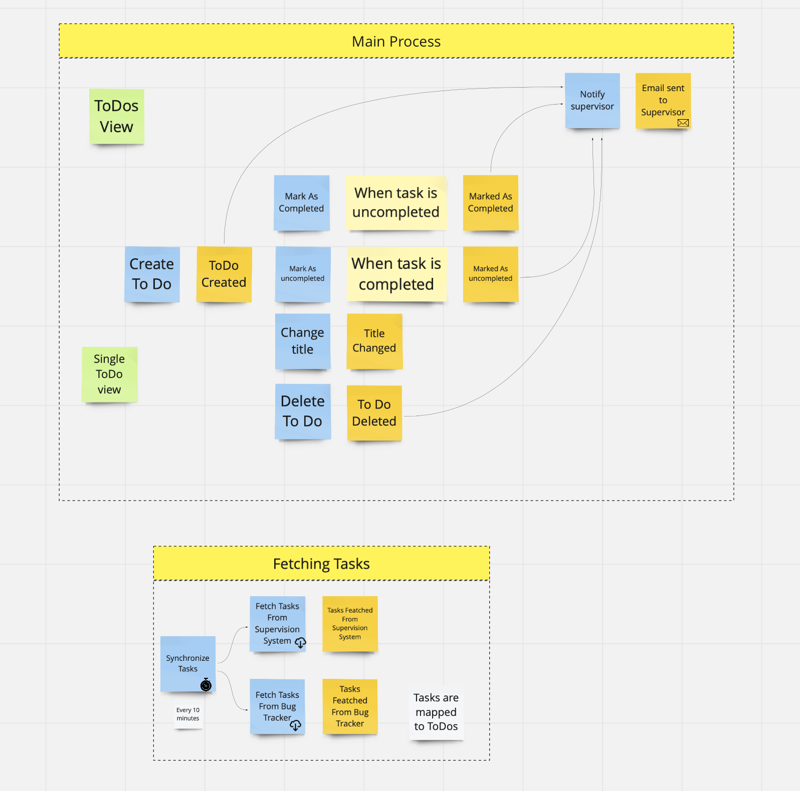
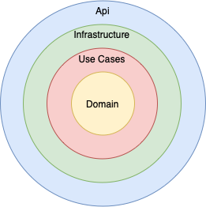

# API using .NET 6 and minimal API approach

## Goals of this repository 
- Show in action Use Case Pattern 

## Project Domain

It's simple To Do solution, when user can create 'to dos' and mark them as completed. To Dos are periodicaly created based on Task from **Supervisor system and Bug Tracker**. 

## Architecture

Architecture is inspired by Clean Architecture invented by Uncle Bob with some modifications. 

### Big picture (layers)

### Implementation Details

