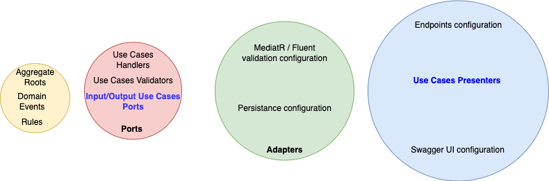
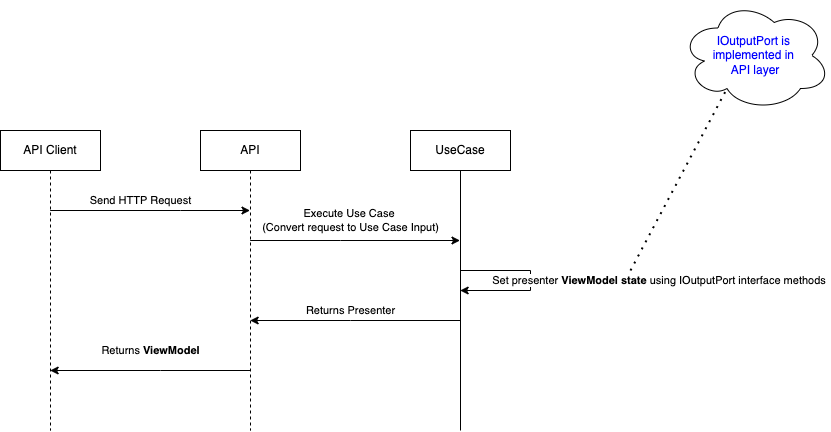

# Use Case Pattern using .NET 6 and minimal API approach

## Goals of this repository 
- show how to implement Use Case Pattern (Described in Uncle Bob Clean Architecture) using .NET 6
- use rich domain approach for "Domain" layer

## Project Domain

It's simple To Do solution, when user can create 'to dos', mark them as completed/uncompleted and change title. 

## Architecture

Architecture is inspired by Clean Architecture invented by Uncle Bob with some modifications. 

### Big picture (layers)

### Implementation Details

## Use Case Pattern 

Use Case layer defines which parameters is needed to execute Use Case (**IUseCaseInput**) and which type of Outputs it can return (**IOutputPort**). 

- Result types are defined by methods in interface. If it is needed, Use Case also can define additional Output type (**OutputResult** type used in Standard Use Case result)
- Presenter decides how response looks like to the API client based on Invoked IOutputPort methods. **Presenters are implemented in layer responsible for serving result for API client**

